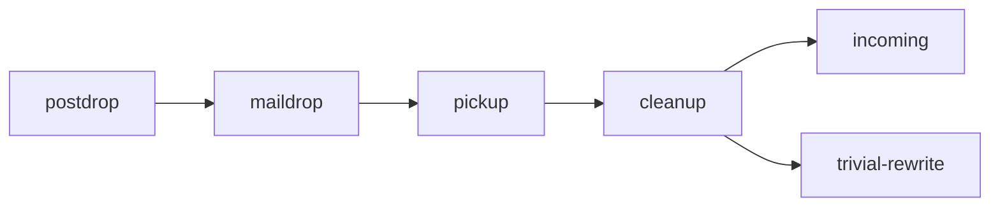

# 第三章 Postfix的结构

## Postfix组件
模块化管理 多数组件dameon的形式存在 master daemon主导邮件处理流程

主要配置文件
- main.cf
- master.cf

处理流程
- 接收邮件
- 将邮件排入队列
- 投递邮件

## 邮件如何进入Postf{ix系统
- 来自服务器内部的邮件



```
postdrop
  |
  v
maildrop    incoming -->
  |            ^
  v            |
pickup ---> cleanup
               ^
               |
               v
            trivial-rewrite
```

- 来自网络的邮件
```shell
            incoming -->
               ^
               |
smtpd -->   cleanup 
               ^
               |
               v
            trivial-rewrite
```

- 通知函 defer daemon 或 bounce daemon 产生通知函

- 转寄邮件 .forward 配置文件


## Postfix队列管理器
进入队列前cleanup daemon 清理邮件，Queue Manager 收到队列有新的信件以后，使用trivial-rewrite来决定邮件的路由信息，包括传输方法、下一站以及收件人地址。

Queue Manager 维护队列
* incoming 收件
* active 活动
* deffered 延迟
* corrupt 故障


## 总结  
