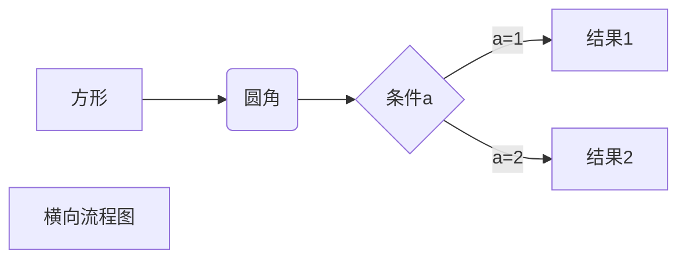
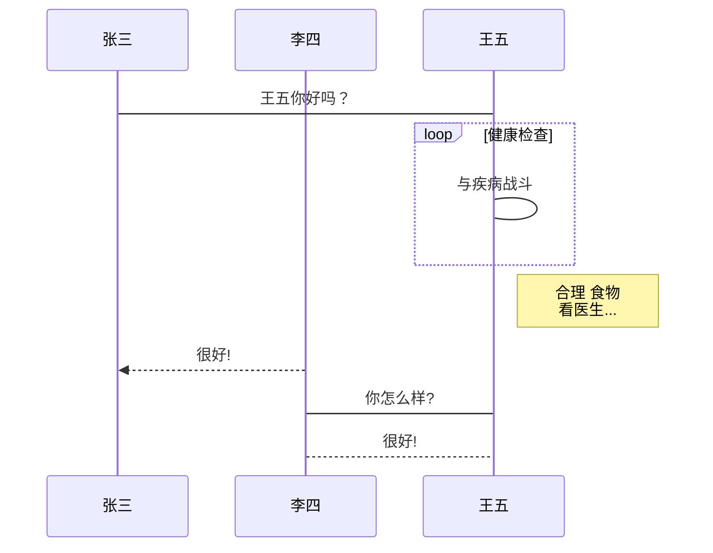
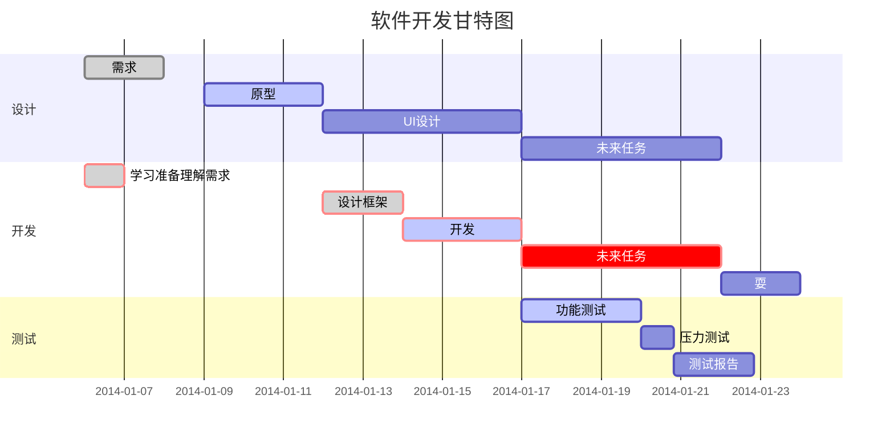

# 1. 横向流程图



# 2. 竖向流程图

```mermind
graph TD
A[方形] -->B(圆角)
    B --> C{条件a}
    C -->|a=1| D[结果1]
    C -->|a=2| E[结果2]
    F[横向流程图]
```

# 3. 标准流程图源码格式
```flow
st=>start: 开始框
op=>operation: 处理框
cond=>condition: 判断框（是或否）
sub1=>subroutine: 子流程
io=>inputoutput: 输入输出框
e=>end: 结束框
st->op->cond
cond(yes)->io->e
cond(no)->sub1(right)->op
```

# 4. 标准流程图源码格式（横向）
``flow
st=>start: 开始框
op=>operation: 处理框
cond=>condition: 判断框(是或否?)
sub1=>subroutine: 子流程
io=>inputoutput: 输入输出框
e=>end: 结束框
st(right)->op(right)->cond
cond(yes)->io(bottom)->e
cond(no)->sub1(right)->op
```

# 5. UML时序图源码样例
```sequence
对象A->对象B: 对象B你好吗?（请求）
Note right of 对象B: 对象B的描述
Note left of 对象A: 对象A的描述(提示)
对象B-->对象A: 我很好(响应)
对象A->对象B: 你真的好吗？
```

# 6. UML时序图源码复杂样例：
```sequence
Title: 标题：复杂使用
对象A->对象B: 对象B你好吗?（请求）
Note right of 对象B: 对象B的描述
Note left of 对象A: 对象A的描述(提示)
对象B-->对象A: 我很好(响应)
对象B->小三: 你好吗
小三-->>对象A: 对象B找我了
对象A->对象B: 你真的好吗？
Note over 小三,对象B: 我们是朋友
participant C
Note right of C: 没人陪我玩
```

# 7. UML标准时序图样例：


# 8. 甘特图样例：



# 数学表达式

[公式指导手册](https://www.zybuluo.com/codeep/note/163962)
[公式参数](https://www.caam.rice.edu/~heinken/latex/symbols.pdf)

## 1 Greek and Hebrew letters
α \alpha κ \kappa ψ \psi z \digamma ∆ \Delta Θ \Theta
β \beta λ \lambda ρ \rho ε \varepsilon Γ \Gamma Υ \Upsilon
χ \chi µ \mu σ \sigma κ \varkappa Λ \Lambda Ξ \Xi
δ \delta ν \nu τ \tau ϕ \varphi Ω \Omega
 \epsilon o o θ \theta $ \varpi Φ \Phi ℵ \aleph
η \eta ω \omega υ \upsilon % \varrho Π \Pi i \beth
γ \gamma φ \phi ξ \xi ς \varsigma Ψ \Psi k \daleth
ι \iota π \pi ζ \zeta ϑ \vartheta Σ \Sigma ג\ gimel
## 2 LATEX math constructs
abc
xyz
\frac{abc}{xyz} abc \overline{abc}
−→abc \overrightarrow{abc}
f
0 f’ abc \underline{abc}
←−
abc \overleftarrow{abc}
√
abc \sqrt{abc} abc c \widehat{abc}
z}|{
abc \overbrace{abc}
√n
abc \sqrt[n]{abc} abc f \widetilde{abc} abc
|{z}
\underbrace{abc}
## 3 Delimiters
| | { \{ b \lfloor / / ⇑ \Uparrow x \llcorner
| \vert } \} c \rfloor \ \backslash ↑ \uparrow y \lrcorner
k \| h \langle d \lceil [ [ ⇓ \Downarrow p \ulcorner
k \Vert i \rangle e \rceil ] ] ↓ \downarrow q \urcorner
Use the pair \lefts1 and \rights2 to match height of delimiters s1 and s2 to the height of their contents, e.g.,
\left| expr \right| \left\{ expr \right\} \left\Vert expr \right.
## 4 Variable-sized symbols (displayed formulae show larger version)
P \sum R
\int U
\biguplus L \bigoplus W
Q
\bigvee
\prod H
\oint T
\bigcap N \bigotimes V
`
\bigwedge
\coprod RR \iint S
\bigcup J \bigodot F
\bigsqcup
## 5 Standard Function Names
Function names should appear in Roman, not Italic, e.g., Correct: \tan(at-n\pi) −→ tan(at − nπ)
Incorrect: tan(at-n\pi) −→ tan(at − nπ)
arccos \arccos arcsin \arcsin arctan \arctan arg \arg
cos \cos cosh \cosh cot \cot coth \coth
csc \csc deg \deg det \det dim \dim
exp \exp gcd \gcd hom \hom inf \inf
ker \ker lg \lg lim \lim lim inf \liminf
lim sup \limsup ln \ln log \log max \max
min \min Pr \Pr sec \sec sin \sin
sinh \sinh sup \sup tan \tan tanh \tanh
## 6 Binary Operation/Relation Symbols
∗ \ast ± \pm ∩ \cap C \lhd
? \star ∓ \mp ∪ \cup B \rhd
· \cdot q \amalg ] \uplus / \triangleleft
◦ \circ  \odot u \sqcap . \triangleright
• \bullet 	 \ominus t \sqcup E \unlhd
 \bigcirc ⊕ \oplus ∧ \wedge D \unrhd
 \diamond  \oslash ∨ \vee 5 \bigtriangledown
× \times ⊗ \otimes † \dagger 4 \bigtriangleup
÷ \div o \wr ‡ \ddagger \ \setminus
 \centerdot  \Box Z \barwedge Y \veebar
~ \circledast  \boxplus f \curlywedge g \curlyvee
} \circledcirc  \boxminus e \Cap d \Cup
 \circleddash  \boxtimes ⊥ \bot > \top
u \dotplus  \boxdot | \intercal i \rightthreetimes
> \divideontimes  \square [ \doublebarwedge h \leftthreetimes
≡ \equiv ≤ \leq ≥ \geq ⊥ \perp
∼= \cong ≺ \prec  \succ | \mid
6= \neq  \preceq  \succeq k \parallel
∼ \sim  \ll  \gg ./ \bowtie
' \simeq ⊂ \subset ⊃ \supset on \Join
≈ \approx ⊆ \subseteq ⊇ \supseteq n \ltimes
 \asymp @ \sqsubset A \sqsupset o \rtimes
.= \doteq v \sqsubseteq w \sqsupseteq ^ \smile
∝ \propto a \dashv ` \vdash _ \frown
|= \models ∈ \in 3 \ni ∈/ \notin
u \approxeq 5 \leqq = \geqq ≶ \lessgtr
∼ \thicksim 6 \leqslant > \geqslant Q \lesseqgtr
v \backsim / \lessapprox ' \gtrapprox S \lesseqqgtr
w \backsimeq ≪ \lll ≫ \ggg T \gtreqqless
, \triangleq l \lessdot m \gtrdot R \gtreqless
$ \circeq . \lesssim & \gtrsim ≷ \gtrless
l \bumpeq 0 \eqslantless 1 \eqslantgtr  \backepsilon
m \Bumpeq - \precsim % \succsim G \between
+ \doteqdot w \precapprox v \succapprox t \pitchfork
≈ \thickapprox b \Subset c \Supset p \shortmid
; \fallingdotseq j \subseteqq k \supseteqq a \smallfrown
: \risingdotseq @ \sqsubset A \sqsupset ` \smallsmile
∝ \varpropto 4 \preccurlyeq < \succcurlyeq  \Vdash
∴ \therefore 2 \curlyeqprec 3 \curlyeqsucc  \vDash
∵ \because J \blacktriangleleft I \blacktriangleright  \Vvdash
P \eqcirc E \trianglelefteq D \trianglerighteq q \shortparallel
6= \neq C \vartriangleleft B \vartriangleright / \nshortparallel
 \ncong  \nleq  \ngeq * \nsubseteq
- \nmid  \nleqq  \ngeqq + \nsupseteq
∦ \nparallel 
 \nleqslant  \ngeqslant " \nsubseteqq
. \nshortmid ≮ \nless ≯ \ngtr # \nsupseteqq
/ \nshortparallel ⊀ \nprec  \nsucc ( \subsetneq
 \nsim  \npreceq  \nsucceq ) \supsetneq
3 \nVDash  \precnapprox  \succnapprox $ \subsetneqq
2 \nvDash  \precnsim  \succnsim % \supsetneqq
0 \nvdash  \lnapprox  \gnapprox \varsubsetneq
6 \ntriangleleft  \lneq  \gneq ! \varsupsetneq
5 \ntrianglelefteq  \lneqq 	 \gneqq & \varsubsetneqq
7 \ntriangleright  \lnsim  \gnsim ' \varsupsetneqq
4 \ntrianglerighteq  \lvertneqq  \gvertne
7 Arrow symbols
← \leftarrow ←− \longleftarrow ↑ \uparrow
⇐ \Leftarrow ⇐= \Longleftarrow ⇑ \Uparrow
→ \rightarrow −→ \longrightarrow ↓ \downarrow
⇒ \Rightarrow =⇒ \Longrightarrow ⇓ \Downarrow
↔ \leftrightarrow ←→ \longleftrightarrow l \updownarrow
⇔ \Leftrightarrow ⇐⇒ \Longleftrightarrow m \Updownarrow
## 7→ \mapsto 7−→ \longmapsto % \nearrow
←- \hookleftarrow ,→ \hookrightarrow & \searrow
( \leftharpoonup * \rightharpoonup . \swarrow
) \leftharpoondown + \rightharpoondown - \nwarrow

 \rightleftharpoons \leadsto
99K \dashrightarrow L99 \dashleftarrow ⇔ \leftleftarrows
 \leftrightarrows W \Lleftarrow  \twoheadleftarrow
 \leftarrowtail " \looparrowleft  \leftrightharpoons
x \curvearrowleft 	 \circlearrowleft  \Lsh
 \upuparrows  \upharpoonleft  \downharpoonleft
( \multimap ! \leftrightsquigarrow ⇒ \rightrightarrows
 \rightleftarrows ⇒ \rightrightarrows  \rightleftarrows
 \twoheadrightarrow  \rightarrowtail # \looparrowright

 \rightleftharpoons y \curvearrowright  \circlearrowright
 \Rsh  \downdownarrows  \upharpoonright
 \downharpoonright \rightsquigarrow
8 \nleftarrow 9 \nrightarrow : \nLeftarrow
; \nRightarrow = \nleftrightarrow < \nLeftrightarrow
## 8 Miscellaneous symbols
∞ \infty ∀ \forall k \Bbbk ℘ \wp
∇ \nabla ∃ \exists F \bigstar ∠ \angle
∂ \partial @ \nexists  \diagdown ] \measuredangle
ð \eth ∅ \emptyset  \diagup ^ \sphericalangle
♣ \clubsuit ∅ \varnothing ♦ \Diamond { \complement
♦ \diamondsuit ı \imath ` \Finv O \triangledown
♥ \heartsuit  \jmath a \Game 4 \triangle
♠ \spadesuit ` \ell ~ \hbar M \vartriangle
· · · \cdots RRRR \iiiint } \hslash  \blacklozenge
.
.
. \vdots RRR \iiint ♦ \lozenge  \blacksquare
. . . \ldots RR \iint f \mho N \blacktriangle
.
.
. \ddots ] \sharp 0 \prime H \blacktrinagledown
= \Im [ \flat  \square 8 \backprime
< \Re \ \natural √
\surd s \circledS
## 9 Math mode accents
a´ \acute{a} a¯ \bar{a}
´A´ \Acute{\Acute{A}} A
¯¯ \Bar{\Bar{A}}
a˘ \breve{a} aˇ \check{a}
˘A˘ \Breve{\Breve{A}} A
ˇˇ \Check{\Check{A}}
a¨ \ddot{a} a˙ \dot{a} A
¨¨ \Ddot{\Ddot{A}} ˙A˙ \Dot{\Dot{A}}
a` \grave{a} aˆ \hat{a}
`A` \Grave{\Grave{A}} ˆAˆ \Hat{\Hat{A}}
a˜ \tilde{a} ~a \vec{a} A
˜˜ \Tilde{\Tilde{A}} ~A~ \Vec{\Vec{A}}
## 10 Array environment, examples
Simplest version: \begin{array}{cols} row1 \\ row2 \\ . . . rowm \end{array}
where cols includes one character [lrc] for each column (with optional characters | inserted for vertical lines)
and rowj includes character & a total of (n − 1) times to separate the n elements in the row. Examples:
\left( \begin{array}{cc} 2\tau & 7\phi-frac5{12} \\
3\psi & \frac{\pi}8 \end{array} \right)
\left( \begin{array}{c} x \\ y \end{array} \right)
\mbox{~and~} \left[ \begin{array}{cc|r}
3 & 4 & 5 \\ 1 & 3 & 729 \end{array} \right]

2τ 7φ −
5
12
3ψ
π
8
  x
y

and 
3 4 5
1 3 729 
f(z) = \left\{ \begin{array}{rcl}
\overline{\overline{z^2}+\cos z} & \mbox{for}
& |z|<3 \\ 0 & \mbox{for} & 3\leq|z|\leq5 \\
\sin\overline{z} & \mbox{for} & |z|>5
\end{array}\right.
f(z) =



z
2 + cos z for |z| < 3
0 for 3 ≤ |z| ≤ 5
sin z for |z| > 5
## 11 Other Styles (math mode only)
Caligraphic letters: $\mathcal{A}$ etc.: A B C D E F G H I J K LM N O P Q R S T U V W X Y Z
Mathbb letters: $\mathbb{A}$ etc.: A B C D E F G H I J K L M N O P Q R S T U V W X Y Z
Mathfrak letters: $\mathfrak{A}$ etc.: A B C D E F G H I J K LM N O P Q R S T U VW X Y Z a b c 1 2 3
Math Sans serif letters: $\mathsf{A}$ etc.: A B C D E F G H I J K L M N O P Q R S T U V W X Y Z a b c 1 2 3
Math bold letters: $\mathbf{A}$ etc.: A B C D E F G H I J K LM N O P Q R S T U VW X Y Z a b c 1 2 3
Math bold italic letters: define \def\mathbi#1{\textbf{\em #1}} then use $\mathbi{A}$ etc.:
A B C D E F G H I J K L M N O P Q R S T U V W X Y Z a b c 1 2 3
## 12 Font sizes
Math Mode:
Z
f
−1
(x − xa) dx ${\displaystyle \int f^{-1}(x-x_a)\,dx}$
R
f
−1
(x − xa) dx ${\textstyle \int f^{-1}(x-x_a)\,dx}$
R
f
−1
(x−xa) dx ${\scriptstyle \int f^{-1}(x-x_a)\,dx}$
R
f−1(x−xa) dx ${\scriptscriptstyle \int f^{-1}(x-x_a)\,dx}$
Text Mode:
\tiny = smallest
\scriptsize = very small
\footnotesize = smaller
\small = small
\normalsize = normal
\large = large
\Large = Large
\LARGE = LARGE
\huge = huge
\Huge = Huge
## 13 Text Mode: Accents and Symbols
´o \’{o} ¨o \"{o} ˆo \^{o} `o \‘{o} ˜o \~{o} ¯o \={o} s. \d s
˙o \.{o} ˘o \u{o} ˝o \H{o} oo \t{oo} ¸o \c{o} o. \d{o} ˚s \r s
o
¯
\b{o} ˚A \AA ˚a \aa ß \ss ı \i  \j ˝s \H s
ø \o s \t s ˇs \v s Ø \O ¶ \P § \S
æ \ae Æ \AE † \dag ‡ \ddag c \copyright £ \pounds
